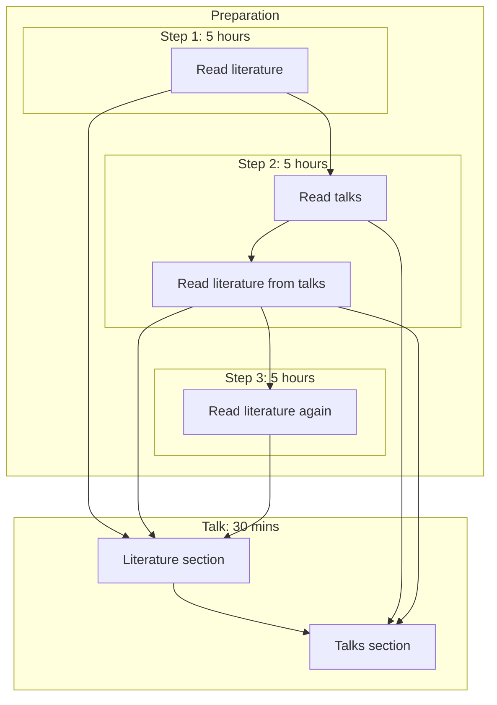

# open_science_presentation_enlight_20240228

My Open Science presentation for ENLIGHT 2024-02-28

 * Formal event title: second ENLIGHT RISE and Arqus Alliance Open Science Ambassador Webinar on 28 February 2024 
 * [Event homepage](https://enlight-eu.org/index.php/university-about-us/news-events/158-news/1061-2nd-enlight-rise-and-arqus-alliance-open-science-ambassador-webinar-on-28-february-2024)
 * Duration of presentation (monologue): 30 minutes
 * YouTube video: [here](https://youtu.be/_RgoN9eGAgI?si=oJRAMbl2v36oipVX)

## Description

Richèl Bilderbeek will present on “The pros and cons of Open Science 
as discussed in the Uppsala local OS community.”

“Open Science is just science done right”. 
This is a slogan one sometimes hears 
at the local Open Science community in Uppsala, called OSU. 
Most OSU visitors do think Open Science leads to 
better-in-some-way science. 
And we know that it is hard to be critical on 
something most of us prefer so much. 
We do, however, try to remain critical and ask questions 
such as: ‘Is it worth it?’. 
In this webinar, Richèl Bilderbeek talks about some of 
the pros and cons of Open Science and the Uppsala community.

## Talk process

